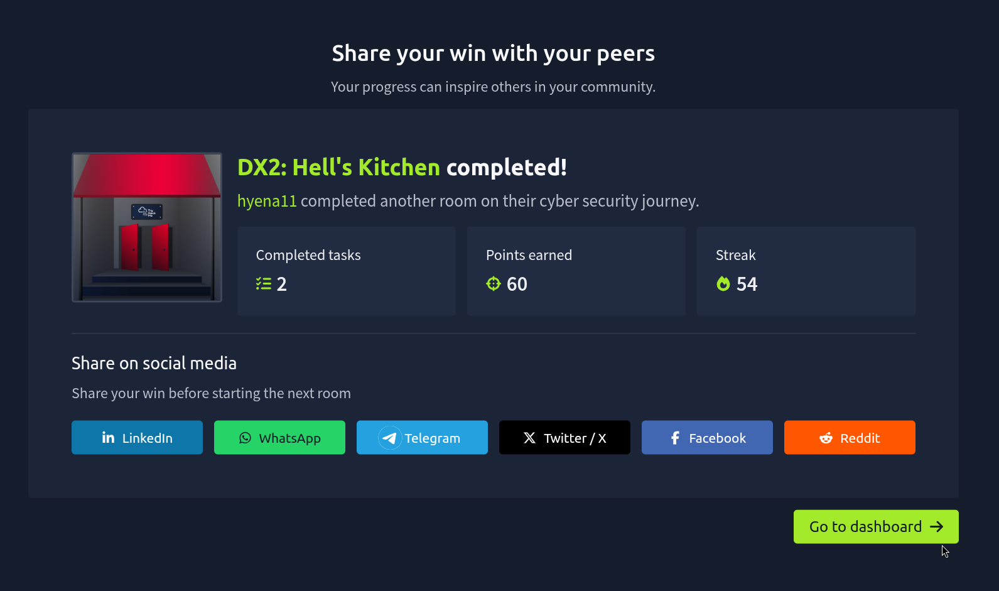
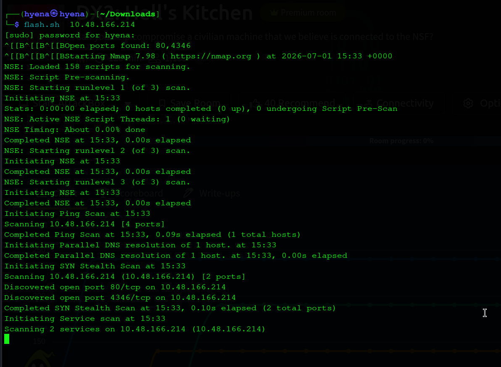
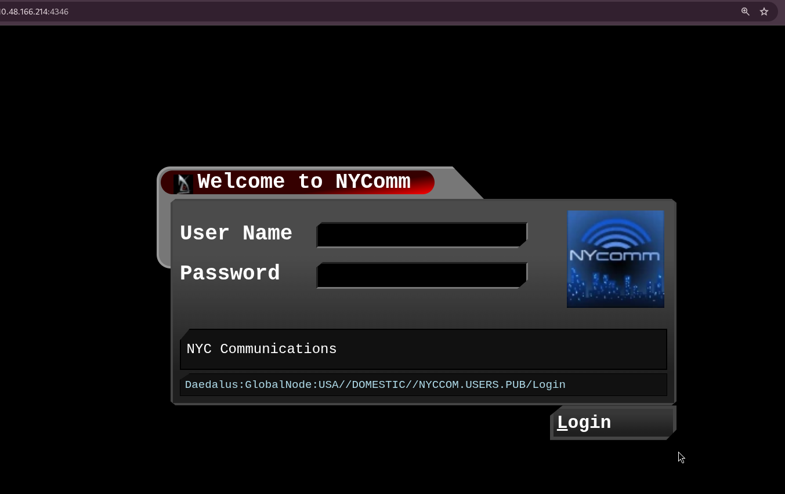
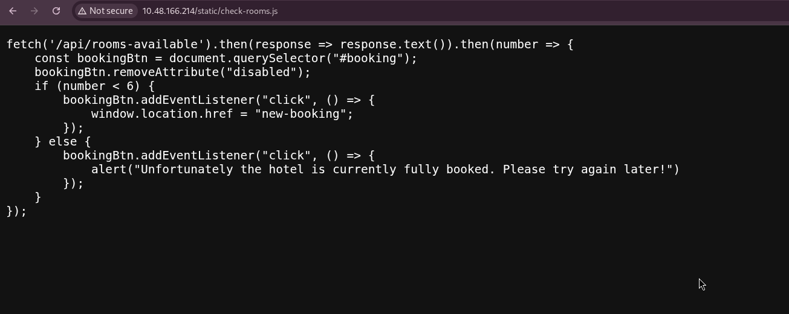
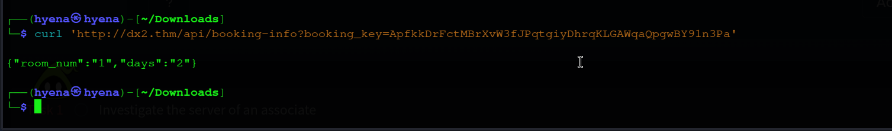
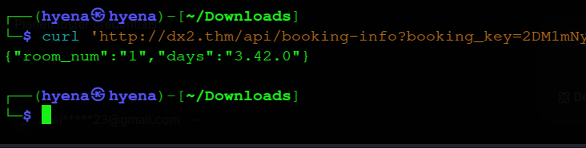
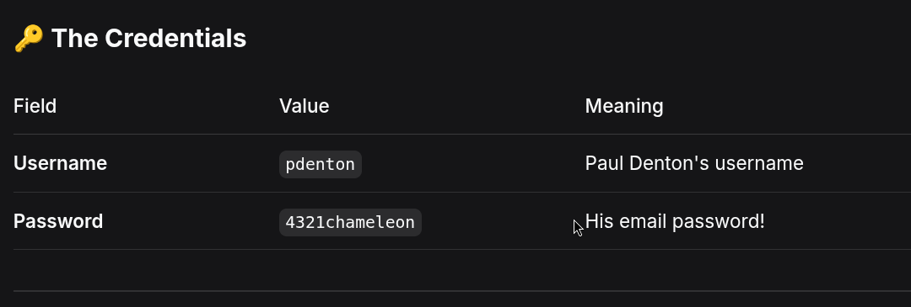
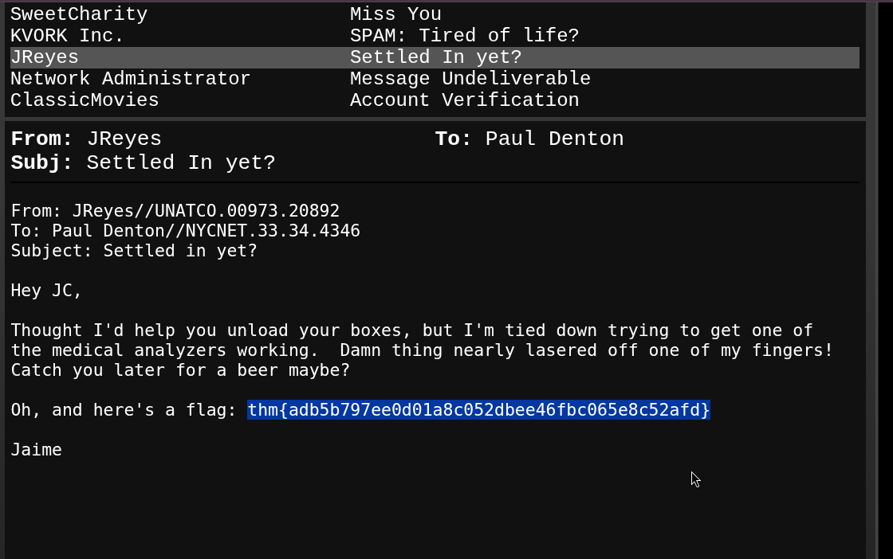
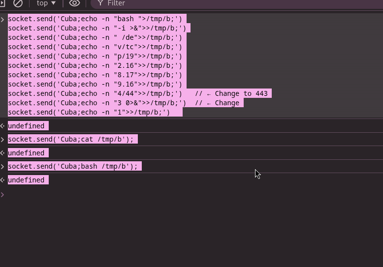
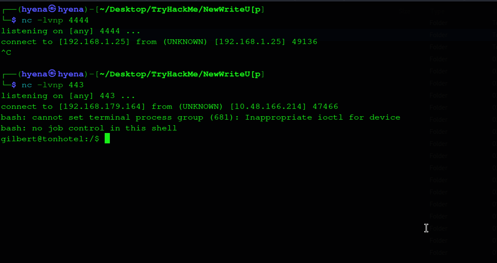

# DX2: Hell's Kitchen — TryHackMe Write-Up



## Overview

This is a write-up for the TryHackMe room **DX2: Hell's Kitchen**. The box mixes web application testing, SQL injection, a WebSocket command injection bug, and lateral movement across three low-privileged users before finishing with an NFS misconfiguration that leads to root.

The full chain, in short:

1. Enumerate the web app and find a hidden booking API.
2. Abuse a Base58-encoded parameter to SQL inject the booking API and dump credentials.
3. Log in to an email portal with those credentials and grab the first flag.
4. Find a command injection bug in a WebSocket "timezone" feature and use it to get a reverse shell.
5. Move from `gilbert` → `sandra` → `jojo` using leaked notes, files, and an image.
6. Abuse a misconfigured `sudo` NFS mount (`no_root_squash`) to get a root shell and the final flag.

All supporting exploit code referenced below lives in the [`Exploit/`](../Exploit) folder, and every screenshot referenced below lives in the [`POC/`](/POC) folder.

---

## 1. Reconnaissance

An `nmap` scan against the target showed two open ports.



- **Port 80** — a hotel website ("Welcome to the 'Ton!")
- **Port 4346** — a login portal called "NYCComm"



---

## 2. Web Enumeration

Looking through the hotel website's source code led to a JavaScript file, `check-rooms.js`, which pointed to a hidden `/new-booking` page.



That page loaded booking details using a cookie called `BOOKING_KEY`. The cookie value turned out to be Base58-encoded and decoded to something like `booking_id:<number>`. This is the parameter the booking API (`/api/booking-info?booking_key=...`) uses to look up a reservation.



---

## 3. SQL Injection on the Booking API

Because the vulnerable parameter had to be Base58 encoded first, a normal SQLi payload can't just be pasted into the URL — it has to be encoded before sending. A small helper script was written for this (see [`Exploit/sqli_booking_key.py`](../Exploit/sqli_booking_key.py)).

Confirming the database engine and version:



With the injection confirmed, `UNION SELECT` was used to pull data out of other tables, including an `email_access` table holding usernames and passwords for the email portal on port 4346.




**Credentials recovered:**

| Field | Value |
|---|---|
| Username | `pdenton` |
| Password | `4321chameleon` |

---

## 4. Email Portal Access — First Flag

Logging into the NYCComm portal on port 4346 with the `pdenton` credentials gave access to an inbox. One of the emails, from a user "JReyes", contained the first flag directly in the message body.



**Flag 1 (user/web flag):**
```
thm{adb5b797ee0d01a8c052dbee46fbc065e8c52afd}
```

---

## 5. WebSocket Command Injection

The email portal page also opened a WebSocket connection (`ws://<target>/ws`) that was used to keep a clock on the page updated. Every second, the browser sent its timezone string to the server, and the server echoed back the time for that zone.

Testing showed the server was building a shell command using the raw client-supplied timezone string, prefixed with the word `Cuba;`. Sending `Cuba;id;` over the socket proved command injection, confirmed by inspecting the returned/observed process output.

The catch: each message could only carry about 24 characters after `Cuba;`, so a full reverse shell one-liner couldn't be sent in one message. Instead, the payload was broken into small chunks, each one appended to a file (`/tmp/b`) on the target using `echo -n ... >> /tmp/b`.



Once the file was fully written and verified with `cat`, it was executed with `bash /tmp/b`, triggering a reverse shell back to a listener.

The full chunking script used for this step is in [`Exploit/websocket_rce_chunker.js`](../Exploit/websocket_rce_chunker.js).

---

## 6. Reverse Shell & Foothold

With a listener running (`nc -lvnp <port>`), executing the staged payload produced a shell as the `gilbert` user.



---

## 7. Lateral Movement — gilbert → sandra → jojo

From `gilbert`'s home directory, a note file hinted that another user, `sandra`, had left a password in a hidden file inside the website's source directory (`/srv/.dad`). That file contained a message from "S" (sandra) with her password included.

Switching to `sandra` and reading the user flag:


*(see also the terminal capture showing `su sandra` and `cat user.txt`)*

Inside `sandra`'s `Pictures/` folder was an image, `boss.jpg`, containing a hidden password for the next user, `jojo`, steganographically/visually embedded in the picture.


Switching to `jojo` and checking `sudo -l` revealed a very specific and exploitable permission:

```
User jojo may run the following commands on tonhotel:
    (root) /usr/sbin/mount.nfs
```

---

## 8. Privilege Escalation — NFS `no_root_squash` Abuse

`jojo` could run `mount.nfs` as root via `sudo`, with no restrictions on what could be mounted or from where. Combined with an NFS export configured with `no_root_squash`, this allows an attacker-controlled NFS share to be mounted on the target, from which a SUID root binary (or a replaced `mount.nfs` binary) can be executed to gain a root shell.

The full step-by-step commands (attacker-side NFS export setup and target-side mount/execute steps) are documented in [`Exploit/nfs_privesc.sh`](../Exploit/nfs_privesc.sh).

Once mounted, running a SUID-root binary staged on the share (or swapping in `/bin/sh` for the `mount.nfs` binary itself and re-running `sudo`) gives a root shell:

```
# id
uid=0(root) gid=0(root) groups=0(root)
# cat /root/root.txt
thm{7f6b4d8aee9e1677a0db343ace5fff23fc5b5d3b}
```

**Flag 2 (root flag):**
```
thm{7f6b4d8aee9e1677a0db343ace5fff23fc5b5d3b}
```

Completion confirmation:


---

## Flag Summary

| Flag | Value |
|---|---|
| User / Web Flag | `thm{adb5b797ee0d01a8c052dbee46fbc065e8c52afd}` |
| Root Flag | `thm{7f6b4d8aee9e1677a0db343ace5fff23fc5b5d3b}` |

---

## Vulnerabilities Found

1. **SQL Injection** in the `booking_key` parameter of `/api/booking-info`, hidden behind Base58 encoding.
2. **Command Injection** in a WebSocket "timezone" feature, allowing arbitrary shell commands.
3. **Weak Credential Storage** — plaintext passwords left in notes and hidden inside an image file.
4. **NFS Misconfiguration** — `no_root_squash` combined with an unrestricted `sudo mount.nfs` permission allowed full privilege escalation to root.

## Suggested Fixes

- Use parameterized queries everywhere user input reaches the database, regardless of any extra encoding wrapped around it.
- Never build shell commands from user-controlled input; validate/allowlist WebSocket message content.
- Never store credentials in plaintext files or images; use a proper secrets manager or hashed storage.
- Never use `no_root_squash` on NFS exports; restrict exports to trusted hosts, and avoid granting `sudo` rights over binaries like `mount.nfs` that can be abused for privilege escalation.

---

## Folder Structure

```
HellsKitchen/
├── README.md          <- this write-up
├── POC/                <- all screenshots referenced above
└── Exploit/             <- exploit scripts used in each stage
    ├── sqli_booking_key.py
    ├── websocket_rce_chunker.js
    └── nfs_privesc.sh
```
