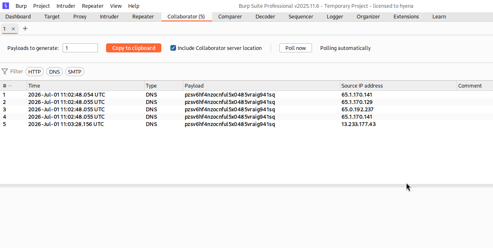
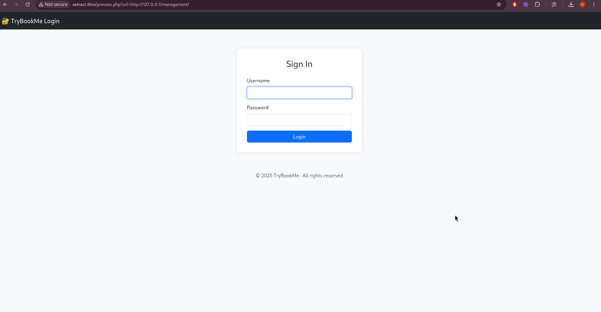
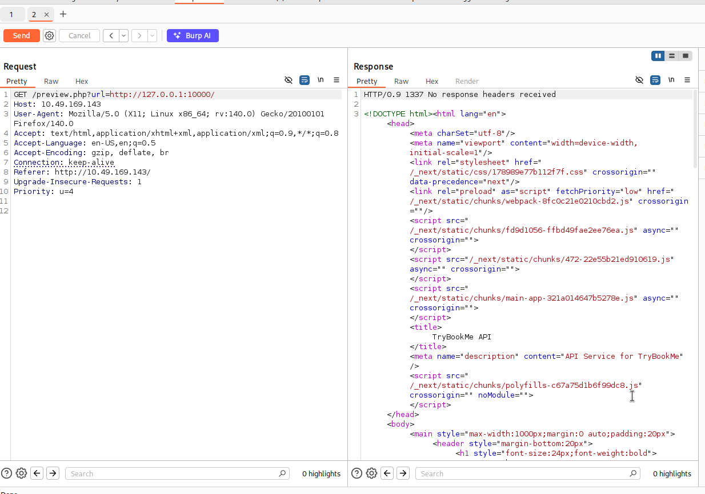
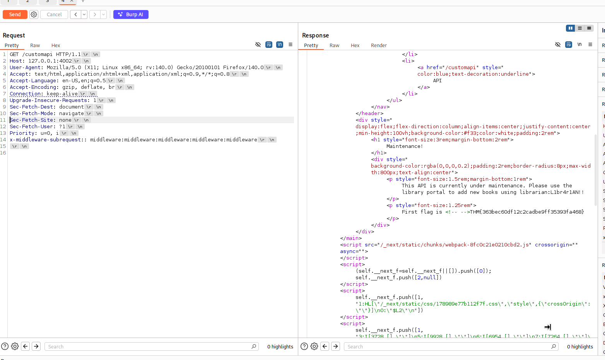
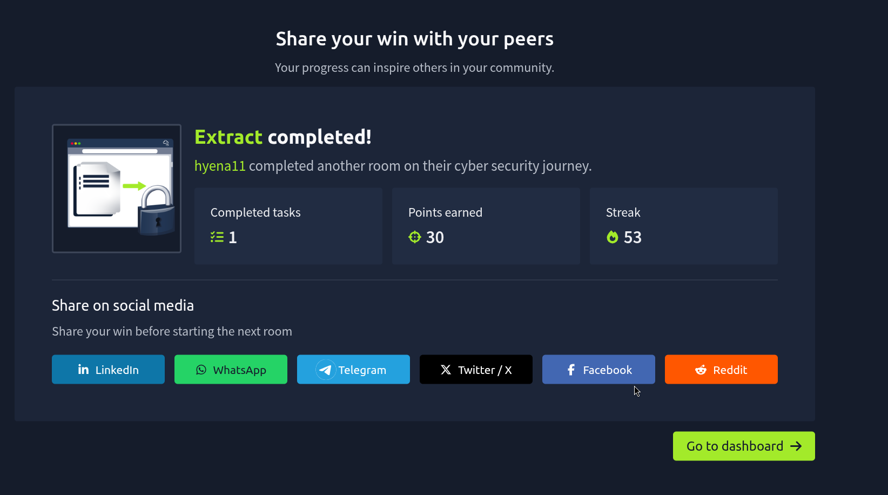

# The Extract Room — A Simple Walkthrough

**TryHackMe · TryBookMe Online Library**
*Difficulty: Hard*

---

## What This Room Is About

TryBookMe is a small online library website. It has one weak spot: a page that previews PDF files will actually go and open any web link you give it. That single flaw is enough to break the whole application step by step — reach hidden internal pages, get around a login check, steal a password, and finally trick the site into thinking we're already logged in as an admin.

Here's the short version of what happened, one step at a time:

- Scanned the server — only a website and SSH were open.
- Found that the PDF viewer loads any link you feed it.
- Proved this could be abused to make the server call back to us.
- Used that trick to peek at pages hidden from the outside world.
- Found a second, hidden service the site was running.
- Got around its login check using a known bug, and built a small tool to reach it.
- That gave us the first flag and a working password.
- Used the password to log in, then tricked the two-factor login step by editing a cookie.
- Got full admin access and the final flag.

---

## Step 1 — Scanning the Server

A quick scan showed only two things were open: a website, and SSH for remote login.

```
22/tcp open  ssh
80/tcp open  http
```

A closer look showed the website was an Apache server running a project called "TryBookMe — Online Library".

---

## Step 2 — Spotting the Weak Point

The homepage lists a couple of PDF books you can preview. Looking at the page's code showed exactly how the preview works: clicking a book sends its link to a file called `preview.php`, which then loads whatever link it was given.


*The site's own code shows it builds a link like preview.php?url=... and loads it straight into the page.*

That's the problem. The server will fetch any URL it's handed, with no real check on where it's pointing. Whenever a server does that, it's worth testing for something called **SSRF** — short for Server-Side Request Forgery. It means the server can be tricked into making requests on our behalf, including requests it was never supposed to make.

---

## Step 3 — Proving the Server Would Follow Our Link

To confirm the bug was real, a listening tool was set up to catch any traffic coming back from the target — Burp Suite's Collaborator. It hands out a one-time web address and shows exactly if and when anything reaches out to it.

That address was placed inside the vulnerable link, and the request was sent.



*Several hits came back almost instantly — proof the server really was following the link we gave it.*

With that confirmed, the SSRF bug was no longer a theory — it was ready to use.

---

## Step 4 — Looking Inside the Server

Because the request comes from the server itself, pointing it at "127.0.0.1" (its own address) lets us see pages that are blocked from outside visitors. Testing this turned up a login page for a management area that wasn't linked anywhere on the public site.



*A hidden management login page, only visible through the SSRF bug — visiting it directly gave an access-denied error.*

---

## Step 5 — Finding a Second Hidden Service

Continuing to explore the server's own network turned up another service, running on port 10000. This one was a completely separate application — a small API built with Next.js, a popular web framework.



*A second internal-only application discovered on port 10000, reachable only from inside the server.*

---

## Step 6 — Getting Past Its Login Check

This new service had a protected page, but visiting it just returned "Not Authorized." Some research pointed to a known issue in that version of Next.js: its login check can be skipped entirely just by adding one specific header to the request.

```
x-middleware-subrequest: middleware:middleware:middleware:middleware:middleware
```

The problem was reaching port 10000 at all — it isn't open to the outside world, only to the server itself. So a small helper tool was built: it takes any request, wraps it up using a trick called the gopher protocol, and sends it through the original PDF-preview bug. In effect, it turns the SSRF flaw into a tunnel, letting normal tools talk to the hidden service as if we were sitting right next to it.

With the tunnel running and the special header attached, the protected page finally opened up.



*The protected page opens up — a maintenance message that leaks the first flag along with a working username and password.*

> The message explained the API was under maintenance and gave a login for the library's management portal, along with the first flag.

---

## Step 7 — Beating the Two-Factor Login

Using the leaked username and password, it was possible to sign into the management portal found earlier. The login worked, but a second security check — two-factor authentication — stood in the way.

Looking closely at the cookie the server handed back after logging in showed something interesting: it contained a small piece of data that simply said whether the two-factor check had been "validated" — true or false. In other words, the server was trusting a value stored on our side of the connection to decide whether we'd passed that check.

That value was changed from false to true, the cookie was updated in the browser, and the page was reloaded. The server read the new cookie, believed the two-factor step was already done, and opened the door straight to the admin area — where the final flag was waiting.

---

## Room Complete



*The Extract room, finished.*

---

## Why This Happened

- The PDF preview page trusted any link it was given, with no checks at all.
- That let an outsider reach pages and services meant only for the server itself.
- An out-of-date Next.js app allowed its whole login check to be skipped with one header.
- A leftover maintenance message gave away a real password.
- The two-factor login relied on a cookie that the user could freely edit, instead of a real check on the server.

## How It Could Be Fixed

- Only allow the preview feature to load links from trusted, known locations.
- Block requests aimed at the server's own address or internal network.
- Keep frameworks like Next.js updated to patch known security bugs.
- Never leave debug or maintenance pages running in production.
- Check two-factor status on the server every time — never trust a cookie alone.
