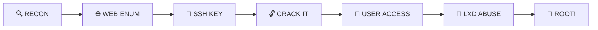

# 🎮 GamingServer - TryHackMe Write-up

```
 ██████╗  █████╗ ███╗   ███╗██╗███╗   ██╗ ██████╗     ███████╗███████╗██████╗ ██╗   ██╗███████╗██████╗ 
██╔════╝ ██╔══██╗████╗ ████║██║████╗  ██║██╔════╝     ██╔════╝██╔════╝██╔══██╗██║   ██║██╔════╝██╔══██╗
██║  ███╗███████║██╔████╔██║██║██╔██╗ ██║██║  ███╗    ███████╗█████╗  ██████╔╝██║   ██║█████╗  ██████╔╝
██║   ██║██╔══██║██║╚██╔╝██║██║██║╚██╗██║██║   ██║    ╚════██║██╔══╝  ██╔══██╗╚██╗ ██╔╝██╔══╝  ██╔══██╗
╚██████╔╝██║  ██║██║ ╚═╝ ██║██║██║ ╚████║╚██████╔╝    ███████║███████╗██║  ██║ ╚████╔╝ ███████╗██║  ██║
 ╚═════╝ ╚═╝  ╚═╝╚═╝     ╚═╝╚═╝╚═╝  ╚═══╝ ╚═════╝     ╚══════╝╚══════╝╚═╝  ╚═╝  ╚═══╝  ╚══════╝╚═╝  ╚═╝
                                                                                                         
                              [ R O O T E D ]  -  by hyena (Muhammad Hozaifa Naeem)
```

> *"Every system has a weakness. Every weakness has an exploit. Every exploit has a story."*

---

## ⚡ The Challenge

What started as a simple web server turned into an epic journey through:
- 🔍 Hidden directories with secrets
- 🔐 Encrypted SSH keys begging to be cracked  
- 🐳 Container misconfigurations screaming for exploitation
- 👑 A root shell waiting at the finish line

**Difficulty:** Medium 🟠 | **Points:** 60 💎 | **Status:** ✅ PWNED

---

## 🎯 The Mission

```
┌─[Mission Briefing]
│
├─ Target: 10.48.132.15
├─ Objective: Gain ROOT access
├─ Time: ~1 hour 15 minutes
└─ Result: COMPLETE SYSTEM COMPROMISE ✓
```

---

## 💥 The Kill Chain



**Phase 1:** Nmap + FFUF → Discovered `/uploads/` with juicy files  
**Phase 2:** Found encrypted SSH key → John the Ripper goes BRRR  
**Phase 3:** Password cracked: `letmein` (seriously? 🤦)  
**Phase 4:** SSH as user `john` → Spot the golden ticket: `lxd` group  
**Phase 5:** Alpine container + privileged mode = GAME OVER  

---

## 🔥 Why This Write-up?

- ✨ **Complete attack path** - Every command, every output, every decision
- 🎓 **Learning-focused** - Understand WHY, not just HOW
- 🛡️ **Defense mindset** - Learn to attack so you can defend better
- 💪 **Real-world skills** - These techniques work in actual pentests

---

## 🛠️ Arsenal Used

```bash
┌──────────────────────────────────────┐
│ Nmap          → Service Discovery    │
│ FFUF          → Directory Fuzzing    │
│ John          → Password Cracking    │
│ ssh2john      → Hash Conversion      │
│ LXD           → Container Pwn        │
│ Alpine Linux  → Lightweight Exploit  │
└──────────────────────────────────────┘
```

---

## 🎖️ What You'll Master

- 🔍 **Advanced Enumeration** - Finding needles in digital haystacks
- 🔓 **Cryptographic Attacks** - When encryption meets weak passwords
- 🐧 **Linux Privilege Escalation** - From user to root in style
- 🐳 **Container Exploitation** - Why LXD group membership = instant win
- 🛡️ **Security Hardening** - Lessons from the defender's perspective

---

## 💬 The Story

> *"I stared at the `/uploads/` directory. Among cat memes and random files, one caught my eye: `secretKey`. My heart raced. Could it be...?*
>
> *It was. An encrypted SSH private key, just sitting there, exposed to the world. One John the Ripper session later, and I was in.*
>
> *But the real prize? Spotting that `lxd` group membership. Game over. Within minutes, I had a root shell and full access to the host filesystem.*
>
> *GamingServer wasn't just rooted—it was a masterclass in how small misconfigurations cascade into complete compromise."*

---

## 🏆 Achievement Unlocked

```
╔═══════════════════════════════════════╗
║  🎮 GAMINGSERVER - DOMINATED 🎮      ║
╠═══════════════════════════════════════╣
║  Completed: January 23, 2026          ║
║  Time: 1h 15m                         ║
║  Flags: 2/2 ✓                         ║
║  Points: 60                           ║
║  Streak: 15 🔥                        ║
╚═══════════════════════════════════════╝
```

---

## 🚀 Why You Should Read This

Because every hacker has a story. Every root shell has a lesson. Every vulnerability teaches us to build better defenses.

**This isn't just a write-up. It's a battle story. A learning journey. A reminder that security is never an accident—it's a choice.**

---

## 📖 Read the Full Write-up

👉 **[Click here to dive deep into the complete exploitation journey](./writeup.md)**

**Warning:** Contains detailed technical breakdowns, exact commands, and might make you rethink your server configurations. 

---

## 🌟 Connect & Learn More

**Author:** Muhammad Hozaifa Naeem  
**TryHackMe:** hyena  
**Room:** GamingServer

*"The only way to truly secure a system is to think like an attacker."*

---

## 💪 Motivation Corner

```
"Security isn't a product. It's a process."
"Break things. Learn things. Build better things."
"Every exploit you learn is a vulnerability you can prevent."
```

🎯 **Keep hacking. Keep learning. Keep breaking (legally).**

---

<div align="center">

**⭐ If this helped you, give it a star! ⭐**

*Happy Hacking! 🚀🔐*

</div>

---

> **Disclaimer:** This write-up is for educational purposes only. All activities were performed in a controlled TryHackMe environment. Always obtain proper authorization before testing systems.